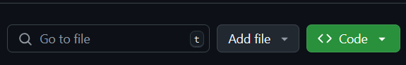
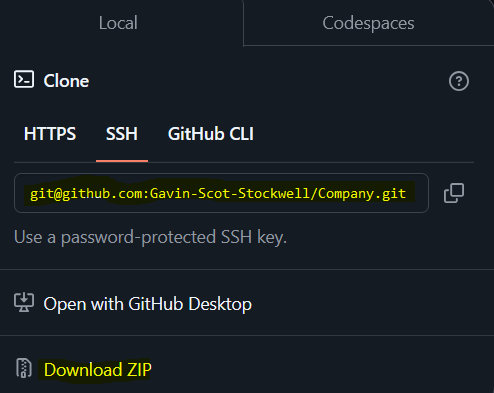

# My Portfolio

## License

# Table Of Contents
* [Description](#description)
* [Installation](#installation)
* [Usage](#usage)
* [License](#license)
* [Contributing](#contributing)
* [Tests](#tests)
* [Questions](#questions)

## Description
My portfolio. It shows my talent to future job offerings. 

## Installation
How to download
* First go to the github link provided below and click.

* Next click the Code button
* Following that you have two choices
* Either download as a clone in your console with the git command “clone …” with the SSH by copying the link and entering the command OR download directly with the zip file and unzip the file

## Usage
To look at my skills and get my face out there.

## Contributing
* Gavin Stockwell -ts

## Tests
* Go the website!
*

## Questions
* GitHub-username https://github.com/Gavin-Scot-Stockwell
* Email-address gsstockwell@gmail.com

# Company
